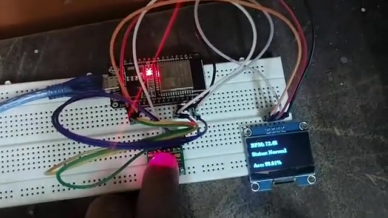
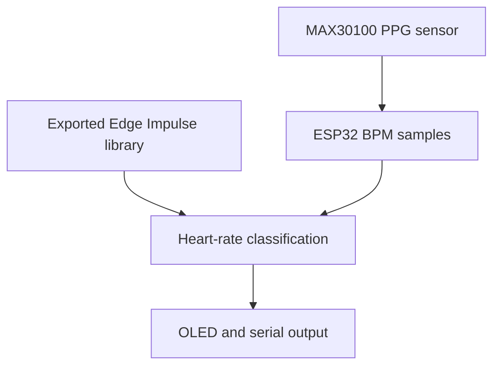

# AI-Enhanced Heart-Rate Classification on ESP32

An educational TinyML prototype that measures photoplethysmography (PPG) pulse data with a MAX30100, calculates heart rate on an ESP32, and displays a heart-rate category on an SH1106 OLED.

> [!CAUTION]
> This is a student prototype, not a medical device. It does **not** diagnose arrhythmia or replace an ECG, a clinician, or emergency care. The hardware measures optical pulse rate (PPG), while the MIT-BIH source data is ECG. Bradycardia/tachycardia thresholds are simplified educational categories and may not be appropriate for an individual.

## Demo

[](media/arrhythmia-demo-enhanced.mp4)


## What the prototype does

- Continuously services the MAX30100 sensor without blocking the ESP32 loop.
- Rejects missing or implausible pulse-rate readings before adding them to a sample window.
- Classifies the current rate into `Bradycardia`, `Normal`, or `Tachycardia` using simple BPM ranges.
- Runs an exported Edge Impulse classifier when its generated library is installed.
- Labels the model output correctly as **confidence**, not accuracy.
- Shows the current BPM, rate category, model result, and confidence on the OLED and serial monitor.



The training source and live sensor are different measurement modalities. A model trained only on RR-derived BPM can learn heart-rate categories, but it cannot identify the full range of ECG rhythm abnormalities or beat morphology.

## Hardware

| Component | Purpose |
|---|---|
| ESP32-WROOM-32 development board | Sampling, feature buffering, inference, and display control |
| MAX30100 module | Optical pulse/SpO2 sensing; this project uses its heart-rate output |
| 1.3-inch SH1106 128×64 OLED | Local status display |
| Breadboard and jumper wires | Prototype connections |

Both I²C modules share the ESP32 bus: SDA on GPIO 21 and SCL on GPIO 22. See [the wiring guide](docs/wiring.md) before powering the circuit.

## Repository layout

```text
.
├── firmware/                  PlatformIO ESP32 firmware
│   ├── lib/                   Place the exported Edge Impulse library here
│   ├── platformio.ini
│   └── src/main.cpp
├── data/                      Dataset format and generated-file guidance
├── docs/wiring.md
├── media/                     Muted demo and preview images
├── report_arrhythmia.pdf      Original project report
└── BATCH_8_...pptx.pdf        Original presentation export
```

## Reproduce the project

### 1. Install an Edge Impulse model

If you already have a reviewed Edge Impulse model matching the firmware's BPM input, export the complete **Arduino library** or **C++ library** package. Put its generated files in `firmware/lib/arrhythmia_inferencing/` and follow the [model installation note](firmware/lib/arrhythmia_inferencing/README.md).

Without that generated model, the firmware still compiles and displays the transparent BPM-range result; the model field reports `Not installed`.

### 2. Build the firmware

Install [PlatformIO](https://platformio.org/), connect the ESP32, then run:

```bash
cd firmware
pio run
pio run --target upload
pio device monitor
```

The sensor needs several seconds of stable finger contact before BPM readings settle. Keep the MAX30100 serviced by calling `pox.update()` continuously; long delays can prevent reliable readings.

## Reported project results

The original report states the following Edge Impulse validation results. They are included for traceability, **not as independently reproduced benchmarks**, because the original trained model, raw exported dataset, split definition, and training logs were not present in the repository.

| Reported metric | Value |
|---|---:|
| Overall validation accuracy | 98.4% |
| Validation loss | 0.04 |
| Bradycardia class accuracy | 100% |
| Normal class accuracy | 97.9% |
| Tachycardia class accuracy | 97.2% |
| Inference time | 1 ms |
| RAM usage | 1.4 KB |
| Flash usage | 15.3 KB |

See [`report_arrhythmia.pdf`](report_arrhythmia.pdf) for the submitted report and methodology. Re-run training with a documented, record-aware holdout before using the figures in a new presentation or publication.

## Important limitations

- MAX30100 is a PPG sensor; it does not capture the diagnostic ECG waveform used by MIT-BIH.
- BPM alone cannot distinguish many arrhythmias that occur at similar average heart rates.
- Motion, poor finger placement, low perfusion, ambient light, and sensor contact can corrupt optical readings.
- The default `<60`, `60–100`, and `>100` BPM labels are simplified resting-rate categories, not patient-specific medical decisions.
- Model confidence is not the probability that a patient has a disease and is not a substitute for external clinical validation.

## References

- [MIT-BIH Arrhythmia Database — PhysioNet](https://physionet.org/content/mitdb/1.0.0/)
- [Edge Impulse Arduino deployment documentation](https://docs.edgeimpulse.com/hardware/deployments/run-arduino-2-0)

## Project team

- Hariprasath P
- Jovikesh P M
- Kathir N
